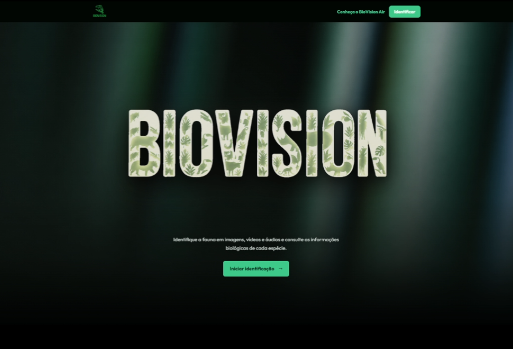

# BioVision Web

<p align="center">
  
</p>

<p align="center">
  <strong>Aplicação para identificação de fauna em imagens, vídeos e áudios, além do processamento de vídeos aéreos no BioVision Air.</strong>
</p>

## Visão geral

O BioVision é uma plataforma Flask para apoiar a identificação de espécies da fauna por meio de imagens, vídeos e áudios, com suporte adicional para análise de vídeos aéreos no módulo BioVision Air.

## Estrutura

- `app.py`: entrada local, executada com `python app.py`.
- `backend/biovision_web/`: configuração, banco, rotas e serviços de inferência.
- `backend/data/`: índice de classes usado pelos modelos.
- `web/templates/`: páginas HTML.
- `web/static_biovision/`: CSS, JavaScript e recursos visuais.
- `models/`: modelos necessários para inferência, versionados com Git LFS.
- `database/`, `training/` e `docs/`: materiais auxiliares sem dados sensíveis.

## Execução local

1. Instale o Git LFS e execute `git lfs pull` caso os modelos não tenham sido baixados no clone.
2. Instale as dependências com `pip install -r requirements.txt`.
3. Configure o MySQL e as demais variáveis em `.env` usando `.env.example` como referência.
4. Execute `python app.py`.
5. Acesse `http://127.0.0.1:5001/biovision/`.

As imagens biológicas são carregadas diretamente pelo navegador a partir de `BIOVISION_IMAGE_BASE_URL` (claudflare). O MySQL armazena apenas os caminhos relativos dos arquivos.

## Produção

Atualmente, o BioVision está rodando em produção na nossa instituição federal de pesquisa.

Para produção com uso reduzido de disco, o `requirements.txt` usa as distribuições oficiais CPU-only do PyTorch. Para evitar cache do `pip` e a cópia adicional dos modelos mantida pelo Git LFS, gere a imagem de produção com o `Dockerfile`:

```bash
docker build -t biovision-iffar .
docker run --env-file .env -p 5001:5001 biovision-iffar
```
